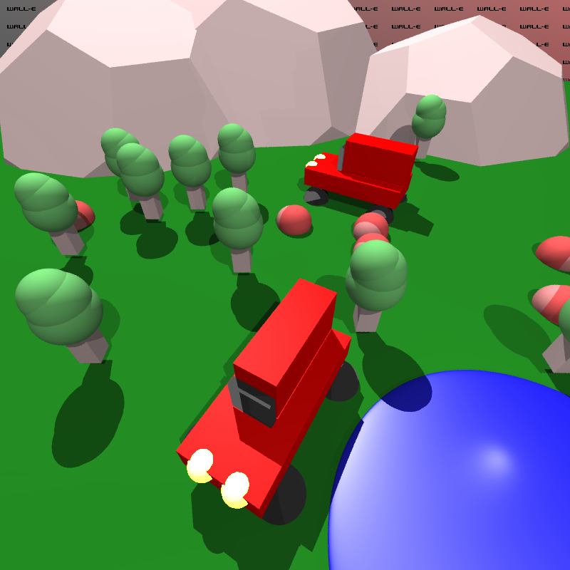

# CS488 - A4: Ray Tracer

-   Name: Devin Leamy
-   UW ID: 20872933
-   UW User ID: dleamy

## WALL-E

> A ray-tracer named after one of the most noble robot out there :)

<p align="center">
  
    <p><i><u>sample.py</u>: Two cars surrounded by trees and piles of leaves, in front of a set of large boulders.</i></p>
</p>

### Structure

-   `/wall-e`: The Rust ray-tracing library.
-   `/wall-e-py`: Rust Python3 bindings, for scripting.
-   `/wall-e-py/assets/meshes`: Contains `.obj` mesh files.
-   `/wall-e-py-macros`: Rust macros used in `/wall-e-py`.
-   `/scripts`: Scripts (scenes) you want to render.
-   `/images`: Images from the scenes requested in the assignment guidelines.
-   `SCRIPTING.md`: Documentation for the scripting API.
-   `PERFORMANCE.md`: Documentation of the impact of introducing bounding volumes on meshes.

### Setup

> _Note: You will need to have Rust and Python3 installed on your system._

Create a virtual environment and install `maturin`.

```bash
cd wall-e-py
python -m venv .env
source .env/bin/activate
pip install maturin
```

### Usage

Scripts, which are python3 files, are put in `/scripts`.

To run a script `./scripts/custom-script.py`, from the root folder, call

```bash
# No debug output.
./run.sh custom-script
# With debug output.
./debug.sh custom-script
```

Rendered images, by default, are placed in the root folder.

### Extra Feature: Supersampling

For each pixel, multiple rays are cast into the scene at offsets from the center. The returned colors are averaged to get the final color of the pixel. Nine samples are taken.

### Dependencies

-   [pyo3](https://github.com/PyO3/pyo3): Interacting with Rust code using Python.
-   `nalgebra`: Linear algebra cratea.
-   `image`: Image processing crate.
-   `lazy_static`: Utility crate for creating global mutable variables with non-const initialization.
-   `obj`: Utility crate for loading `obj` files.
-   [maturin](https://github.com/PyO3/maturin): Building python3 module generated using `pyo3`.
-   `rand`: Utility crate for random number generation.

### Implementation Notes

-   Bounding volumes are cubes that are placed around meshes.
-   The hierarchical scene `Scene`, is converted into a `FlatScene` where the transforms are "baked", before processing.
-   Lights are nodes and can be placed like any other kind of hierarchical node.
-   `Collidable` is the trait implemented for all the geometry that can be collided with.
-   The ray tracing is multi-threaded, using 12 threads.
